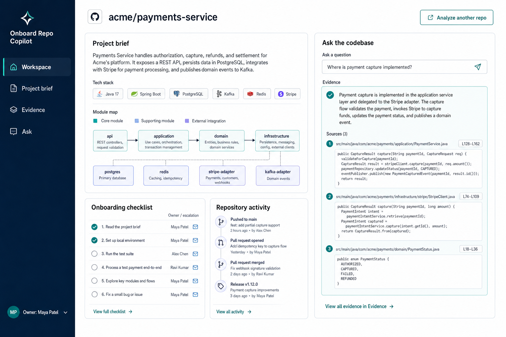
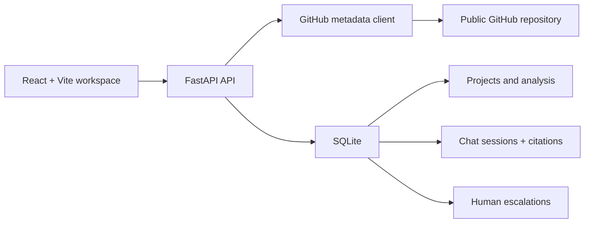

# Onboard Repo Copilot

Turn a public GitHub repository into an evidence-backed onboarding workspace: a concise project brief, module map, cited Q&A, named owner, and human handoff when the evidence is not strong enough.



## What works today

- Creates a workspace from a **public `https://github.com/owner/repository` URL**.
- Uses GitHub’s public API for repository metadata and root structure; if it is unavailable, produces a clearly marked local fallback brief so the full demo remains usable offline.
- Stores project metadata, chat sessions, messages, citations, and escalation requests in local SQLite.
- Answers onboarding questions with cited repository evidence and recommends a human handoff when confidence is low.
- Includes a built-in fictional payments-service workspace for an immediate end-to-end demo.
- Runs with no OCI, Slack, Qdrant, LLM, or GitHub token configuration. Those integrations are intentionally future opt-ins.

## Why this exists

New engineers often receive a repository URL but no reliable starting point. This project consolidates the codebase-understanding workflow from `askRepo` with the project ownership and escalation workflow from `OnboardAI_Buddy` into one focused product.

## Architecture



The API accepts only public GitHub repository URLs. It does not clone repositories, accept arbitrary URLs, or index secret-bearing files.

## Quick start

### Local development

```bash
cp .env.example .env
python3 -m venv .venv
.venv/bin/python -m pip install -r backend/requirements.txt

# Terminal 1
cd backend
../.venv/bin/uvicorn app.main:app --reload --host 127.0.0.1 --port 8000

# Terminal 2
cd frontend
npm ci
npm run dev
```

Open [http://localhost:5173](http://localhost:5173). Select **Open example** to test the complete workflow immediately, or add a public GitHub repository.

### Docker Compose

```bash
cp .env.example .env
docker compose up --build
```

- App: [http://localhost:5173](http://localhost:5173)
- API documentation: [http://localhost:8000/docs](http://localhost:8000/docs)

## Test

```bash
# Backend API and deterministic fallback tests
cd backend && ../.venv/bin/python -m pytest -q

# Frontend component tests and production build
cd ../frontend && npm run test -- --run && npm run build

# Browser smoke tests (start the API and Vite app first)
E2E_BASE_URL=http://localhost:5173 npm run test:e2e
```

The automated API flow covers health → workspace creation → onboarding Q&A → escalation. The component suite covers empty state, example workspace, error rendering, and cited Q&A/handoff state. The Playwright suite verifies the complete desktop journey and a 390px mobile layout without horizontal overflow.

## Configuration

Copy `.env.example` to `.env`. The tracked example contains no secret values; `.env`, `.env.test`, local SQLite databases, build output, and virtual environments are ignored by Git.

`GITHUB_TOKEN` is optional and only increases public GitHub API limits. Keep `ENABLE_OCI_GENAI` and `SLACK_NOTIFY_ESCALATIONS` disabled until a future authenticated deployment has been designed.

## Safety and limitations

- This is a single-user/local portfolio demo, not a multi-tenant production service.
- Metadata analysis is deliberately shallow: it reads GitHub’s public repository metadata and root listing, then exposes its evidence. It does not claim to fully understand uninspected source files.
- Do not use it with private repositories, secrets, customer data, or a production deployment without authentication, authorization, rate limits, audit controls, and a fuller content-security review.

## Provenance and learning log

See [LEARNINGS.md](LEARNINGS.md) for source provenance, consolidation decisions, security fixes, and every issue resolved during this build.
